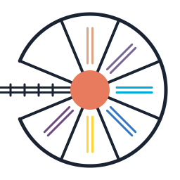

<p align="center">
  
</p>

# Roundhouse

*Rails as a specification; deployment is a build flag.*

Roundhouse reads Ruby source — specifically, Rails applications — and
produces standalone projects in other target languages. The deployment
target (Rust binary, TypeScript bundle, Crystal or Go service, Elixir
OTP app, Python project, browser bundle, or Spinel-compiled Ruby)
becomes a compiler flag rather than a runtime choice.

A roundhouse is the circular hub in a rail yard where engines rotate and
route onto different tracks. That's the pipeline shape: one Ruby source
at the center, analyzed and dispatched to one of N target tracks.

*For the case for doing this at all — the constraints that push
successful Rails apps off CRuby, and the option value of preserving
the choice — see [WHY.md](WHY.md).*

## Pipeline

```
          ingest       analyze        lower         emit
Ruby ────▶ AST ─────▶ typed IR ────▶ IR ─────▶ target project
                         │             │
                         ▼             ▼
                    diagnostics    runtime/<target>/
```

Ingest normalizes Ruby + ERB into a small typed IR. Analyze annotates
every expression with a type and effect set, flowing types along the
edges Rails conventions already draw (schema → models, associations,
before_action, render → view, partials). Lower expands Rails-dialect
nodes into target-neutral IR — validations become `Check` enums, routes
become a flat dispatch table, controller bodies become a walker-ready
`LoweredAction`. Additional passes canonicalize controller idioms
(`params.to_h`, `redirect_to`, path helpers, association builders) and
query DSL (`order`, `includes`, `where`) into shapes each emitter
consumes directly. Emit walks the IR per target, consulting each
expression's type and effect where the target needs it, and each emitted
project links a small hand-written `runtime/<target>/` library for the
bits that don't belong in generated code (DB connection, HTTP server,
Action Cable).

Diagnostics surface anything the analyzer couldn't type — the subset
of programs we can transpile is defined by "zero diagnostics."

## Current state

The analyzer fully types the Phase-1 Rails 8 MVC fixture
(`fixtures/real-blog`) without annotations — schema-derived attributes,
associations, controller actions, `before_action` flow, views,
partials, and collection rendering all resolve to concrete types.
A test enforces zero diagnostics on every commit.

Seven target emitters are live: **Rust** and **TypeScript** now produce
runnable projects end-to-end — they boot an HTTP + Action Cable server,
serve the generated blog with working forms, validation error display,
Turbo streams, and Tailwind styling. Crystal, Elixir, Go, Python, and
the Spinel-targeted Ruby emitter share the same controller walker and
pre-emit lowering passes; their runtime glue is in flight.

Cross-runtime correctness is enforced by `tools/compare/`, which
fetches the same URL from Rails and from any roundhouse-emitted runtime
and diffs the canonicalized DOM trees. A new ERB pattern that renders
differently between Rails and a target is a bug.

## Supporting pieces worth knowing

- **Method catalog** (`src/catalog/`) — one IDL-shaped table declaring
  effect class, chain semantics, and return-type facets for every AR
  method the compiler recognizes. Single source of truth; replaced five
  scattered places.
- **Database adapter** (`src/adapter.rs`) — `DatabaseAdapter` trait
  behind which effect classification and async-suspension decisions
  live. `SqliteAdapter` / `SqliteAsyncAdapter` today; Postgres /
  IndexedDB / D1 / Neon land as sibling impls.
- **Per-target runtimes** (`runtime/<target>/`) — hand-written glue
  (DB connection, HTTP, view helpers, Action Cable, test support)
  included verbatim by the matching emitter.

## Running the tests

```
cargo test                              # unit + analyze + ingest + emit
cargo test --test real_blog             # the Phase-1 forcing functions
cargo test --test rust_toolchain -- --ignored   # Rust end-to-end boot
```

The `real-blog` fixture is generated on demand — `make real-blog` runs
`scripts/create-blog` and materializes it under `fixtures/real-blog/`.
CI regenerates the fixture once per run and shares it across the unit
job and each per-target toolchain job.

## Documentation

- [`DEVELOPMENT.md`](DEVELOPMENT.md) — day-to-day dev loop, the
  `roundhouse-ast` debugging tool, adding a new IR variant.
- [`docs/data/`](docs/data/) — the compiler's inputs, one doc each for
  Ruby + ERB, schema/routes/seeds, the method catalog, and the
  database adapter.
- [`docs/pipeline/`](docs/pipeline/) — pipeline internals: analyze,
  lower, emit, runtime integration, verification.

## Prior art

- [railcar](https://github.com/rubys/railcar) — the Crystal-based predecessor; taught us which bets were worth keeping and where the shape needed to change.
- [ruby2js](https://www.ruby2js.com) — transpiles Ruby to JavaScript; originator of the filter/escape-hatch pattern for per-app transformations.
- [Juntos](https://www.ruby2js.com/docs/juntos/) — ruby2js extension that transpiles entire Rails apps; validated the multi-target ambition against Basecamp's Writebook.

## Contributing

Issues and discussion are welcome. Architecture is still forming —
a quick conversation before a PR is usually the most helpful path.

## License

Dual-licensed under either of

- [MIT License](LICENSE-MIT)
- [Apache License, Version 2.0](LICENSE-APACHE)

at your option.
